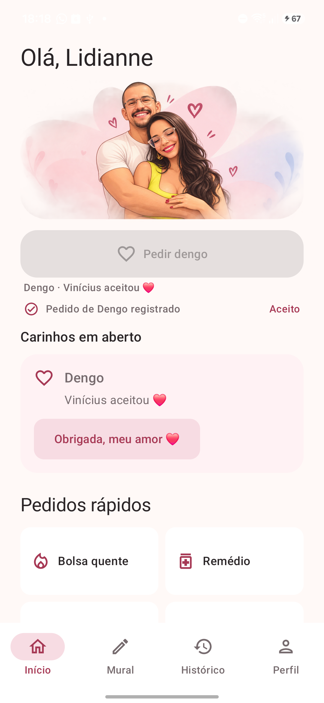
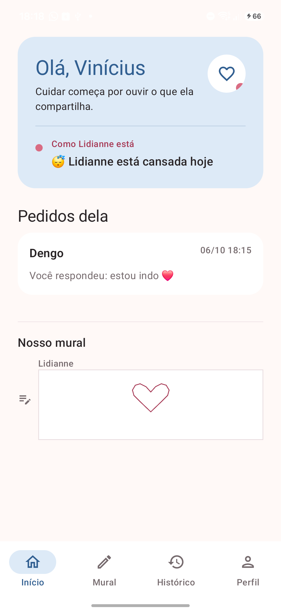
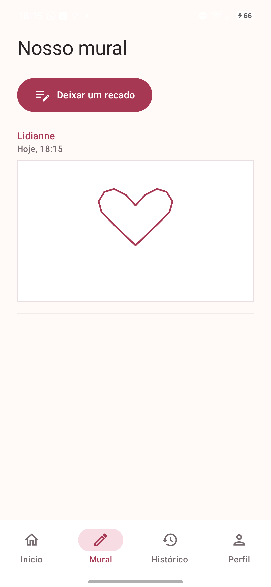
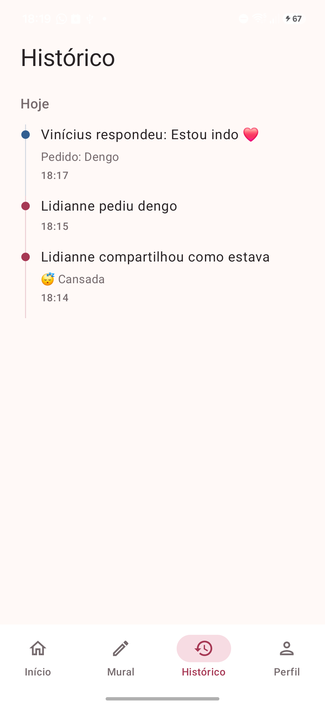
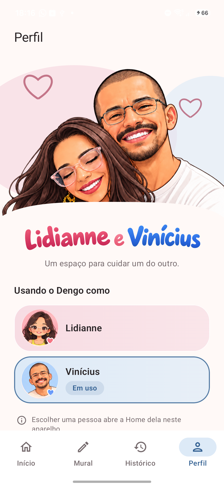

# Dengo

### Small gestures of care, made easier to share.

Dengo is a personal Android prototype for Lidianne and Vinícius. It gives two people a simple, affectionate way to share a care request, a mood, personal space, or a note. It is designed around communication between people, rather than caring for a virtual pet or completing game tasks.

## Screenshots

Captured directly from the app running on a Samsung Galaxy A26.

<p align="center">
  
  
  
</p>
<p align="center">
  
  
</p>

## Current experiences

- **Two Home perspectives:** Lidianne can share a mood, request care, or signal that she needs personal space. Vinícius can see that context and respond to active requests.
- **Care requests:** requests can be accepted or declined; an accepted request can later be acknowledged. A response is not treated as proof that the requested care happened.
- **Mural:** both perspectives can leave individual text or hand-drawn notes and see the same in-memory list.
- **History:** a read-only timeline provides context for requests, responses, mood changes, and personal space.
- **Profile:** switch locally between Lidianne's and Vinícius's perspectives on the same device.

This is a local prototype. Its shared state is held in memory and is lost when the app process ends. It does not provide account sign-in, remote communication, notifications, or synchronization between devices.

## Project status

The current prototype includes the first seven product stages and later approved work on the care request cycle, drawn Mural notes, and Profile B.1. These experiences were reviewed on a Samsung Galaxy A26 as recorded in [project status](docs/STATUS.md) and the [decision records](docs/decisions/). The next product stage has not been selected. Dengo is not presented as a production service or a published app.

## Technology and structure

- Kotlin, Jetpack Compose, and Material 3
- A single Android application module: `:app`
- Compose screens backed by screen-level ViewModels
- A shared in-memory `FakeCoupleRepository` for the prototype state
- JUnit tests for local logic and Android instrumentation tests for UI flows

There is no backend or persistent data layer in the current prototype.

## Getting started

### Requirements

- JDK 17
- Android SDK 36 (installed through Android Studio's SDK Manager)
- An Android device or emulator running Android 7.0 (API 24) or newer to install the app

Clone the repository, then build and run the local checks with the Gradle wrapper:

```bash
git clone https://github.com/ViniciusRio/dengo-app.git
cd dengo-app
./gradlew assembleDebug
./gradlew test
```

To install the debug build on a connected device or running emulator:

```bash
./gradlew installDebug
```

To run the instrumented tests, start an emulator or connect an Android device with USB debugging enabled, then run:

```bash
./gradlew connectedDebugAndroidTest
```

## Testing and device review

The project has local unit tests under `app/src/test` and Android instrumentation tests under `app/src/androidTest`. The approved prototype has also received human visual and functional review on a Galaxy A26; the scope and limits of each review are recorded in the relevant feature documents and ADRs. Automated tests and device review cover different parts of the app.

## Documentation

- [Product principles](docs/PRODUCT.md) and [MVP scope](docs/MVP.md)
- [User flows](docs/USER-FLOWS.md) and [current project status](docs/STATUS.md)
- [Feature specifications](docs/features/)
- [Screen and design documentation](docs/design/)
- [Architecture and product decisions](docs/decisions/)
